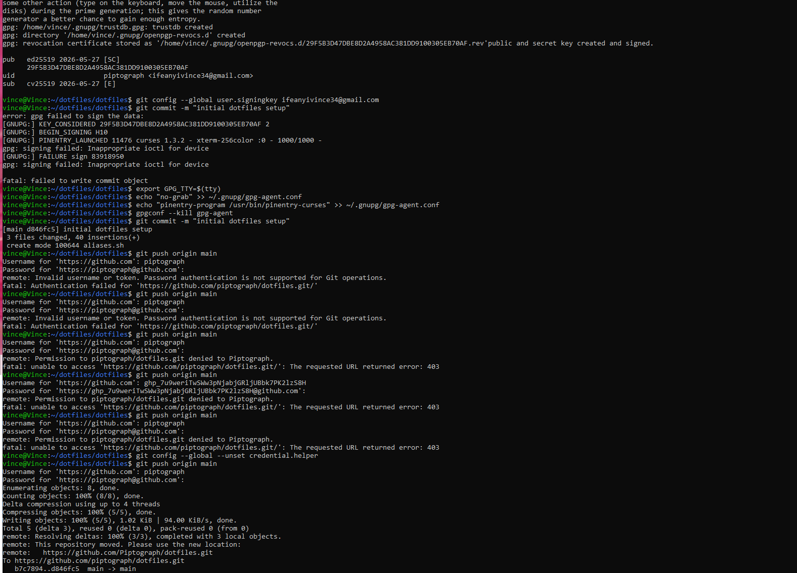

# My Dotfiles

Personal Linux shell configuration and automated setup environment. This repository serves as a baseline configuration for managing system aliases, customized environment variables, and automated shell synchronization via WSL (Windows Subsystem for Linux).

## Features

- **Automated Bootstrapping**: Scripted deployment to instantly symlink configurations to new machine profiles.
- **Modular Shortcut Management**: Segmented alias profiles keeping production scripts isolated from runtime shells.
- **Cross-Platform Bridge Integration**: Configured path discovery linking local WSL layers directly with Windows host storage spaces.

## Repository Architecture

```text
dotfiles/
├── .bashrc          # System environment runtime settings
├── bootstrap.sh     # Automation setup shell script
├── aliases.sh       # Custom shell shortcut profiles
├── README.md        # Technical project documentation
└── screenshots/     # Terminal environment visual validation
```

## Installation

To clone and automatically deploy these configurations onto a fresh machine environment, execute the following instructions:

```bash
git clone https://github.com
cd dotfiles
chmod +x bootstrap.sh
./bootstrap.sh
```

## Preview



## Author

- **Piptograph** - [GitHub Profile](https://github.com)
